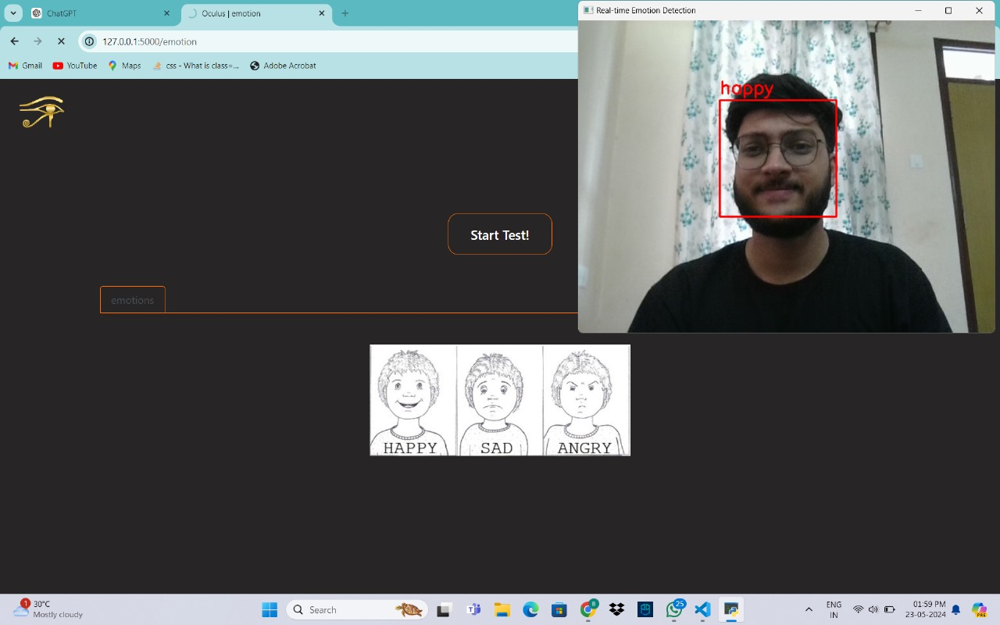
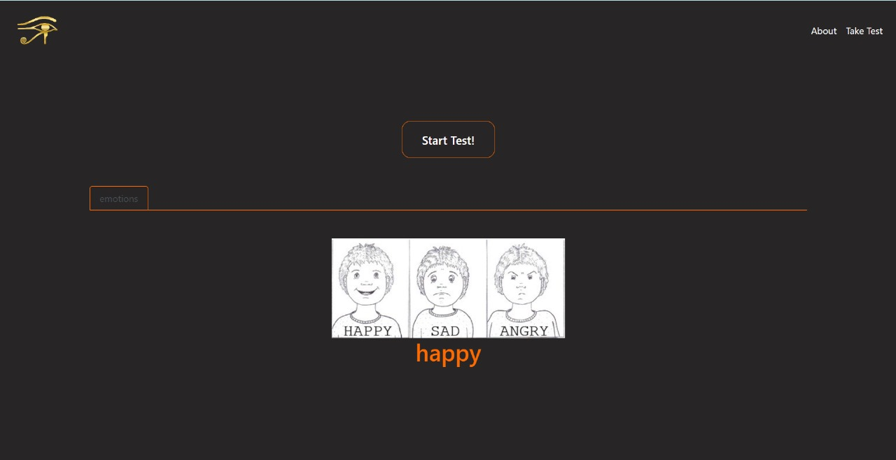

# oculus

The project aims real time emotion detection & early detection of 'Autism' & 'ADHD' through a web platform fueled by machine learning. 

  

 

#### Problem Addressed
It is estimated that 1 in 59 children have Autism. Early warning signs of potential development of autism are very useful, because the treatment procedures can be started earlier, thus decreasing the struggle of the child. Cheap, fast and easy methods for detecting early warning signs of these disorders of the neurological development of children are needful.

A chronic condition including attention difficulty, hyperactivity and impulsiveness. ADHD often begins in childhood and can persist into adulthood. It may contribute to low self-esteem, troubled relationships and difficulty at school or work. Symptoms include limited attention and hyperactivity. Treatments include medication and talk therapy.

#### Solution
A free, web-based-application that uses a standard computer webcam to screen a child while reading a passage on the screen and recording fixation
time while reading.

 
 

<table align="center">
   <tr>
      <th></th>
      <th></th>
   </tr>
</table>

 
 

#### Approach
1. Get real-time info of user's eye movement using OpenCV.
2. Gather the co-ordinates of the pupil according to the viewport.
3. Plot a line graph for the co-ordinates.
4. Pass the resulting graph through CNN for classifying.
5. Displaying the test result.

#### Project Structure
   - main.py :
      - embedding the machine learning model to flask
      - routing functions
   - templates/ :
      - frontend files
   - static/ :
      - media files
   - model/ :
      - pre-trained [pickle file](https://drive.google.com/drive/folders/1cbGqqAX158DpoyzcCD8W4o_yt_R6IjNx?usp=sharing)

### Dependencies
   - Flask
   - OpenCV
   - Tensorflow
   - Matplotlib
   - Deeplearning
